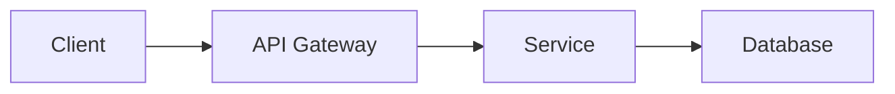

# PSS-nano Developer Documentation

Welcome to the PSS-nano (Passenger Service System) comprehensive developer documentation.

## About This Documentation

This documentation site is built with [Docusaurus](https://docusaurus.io/) and provides complete technical documentation for developers working on the PSS-nano platform.

## Documentation Structure

### 📚 Main Sections

1. **Getting Started** - Quick start guide for new developers
2. **Architecture** - System design, microservices, data flow, and technical decisions
3. **Services** - Detailed documentation for each microservice
4. **API Reference** - Complete API documentation with examples
5. **Data Model** - Database schemas, relationships, and migrations
6. **Guides** - How-to guides for development, testing, deployment, and operations
7. **Security** - Security best practices and guidelines
8. **Contributing** - How to contribute to the project
9. **Glossary** - Airline and technical terminology

## Quick Start

### Prerequisites

- Node.js 20+
- npm 10+

### Local Development

```bash
# Install dependencies
npm install

# Start development server
npm start

# Build for production
npm run build

# Serve production build
npm run serve
```

The documentation will be available at `http://localhost:3000`.

## Documentation Features

### Mermaid Diagrams
We use Mermaid for creating diagrams directly in Markdown:



### Code Syntax Highlighting
Comprehensive syntax highlighting for multiple languages:
- TypeScript
- JavaScript
- JSON
- YAML
- Bash
- SQL
- Docker

### Search Functionality
Built-in search powered by Algolia (to be configured with your app ID).

### Versioning
Documentation supports versioning for different PSS-nano releases.

## Contributing to Documentation

### Adding New Pages

1. Create a new `.md` file in the appropriate `docs/` subdirectory
2. Add frontmatter:
   ```markdown
   ---
   title: Page Title
   sidebar_position: 1
   ---
   ```
3. Update `sidebars.ts` if needed
4. Submit a pull request

### Documentation Standards

- **Clear and Concise**: Write for your audience
- **Code Examples**: Include working code samples
- **Diagrams**: Use Mermaid for architecture diagrams
- **Up-to-Date**: Keep documentation synchronized with code
- **Links**: Cross-reference related documentation

### File Organization

```
docs/
├── architecture/           # System architecture
│   ├── overview.md
│   ├── microservices.md
│   ├── data-flow.md
│   └── technology-stack.md
├── services/               # Service documentation
│   ├── catalog.md
│   ├── api-gateway.md
│   └── ...
├── api/                    # API documentation
│   ├── overview.md
│   ├── auth/
│   ├── reservation/
│   └── ...
├── guides/                 # How-to guides
│   ├── development-setup.md
│   ├── testing.md
│   ├── deployment.md
│   └── ...
├── data-model/            # Database documentation
│   ├── overview.md
│   ├── schemas.md
│   └── ...
├── security/              # Security guidelines
│   ├── overview.md
│   └── ...
├── getting-started.md     # Quick start
├── contributing.md        # Contribution guide
└── glossary.md           # Terminology
```

## Deployment

### GitHub Pages

```bash
# Deploy to GitHub Pages
GIT_USER=<Your GitHub username> npm run deploy
```

### Custom Domain

Configure your domain in `docusaurus.config.ts`:

```typescript
url: 'https://docs.pss-nano.com',
baseUrl: '/',
```

### CI/CD

Automated deployment is configured via GitHub Actions. Every push to `main` triggers a deployment.

## Documentation Best Practices

### Writing Style

- Use active voice
- Keep sentences short and simple
- Use headings to organize content
- Include code examples
- Add diagrams where helpful

### Code Samples

- Ensure code samples work
- Include comments for clarity
- Show both good and bad examples
- Provide full context

### Diagrams

- Use Mermaid for consistency
- Keep diagrams simple and focused
- Label all components clearly
- Use consistent styling

### Links

- Use relative links for internal pages
- Verify links work
- Use descriptive link text
- Add external links where relevant

## Support

For documentation issues:
- Create an issue on GitHub
- Label with `documentation`
- Provide specific feedback
- Suggest improvements

## License

This documentation is licensed under the MIT License.

## Credits

Built with:
- [Docusaurus](https://docusaurus.io/)
- [Mermaid](https://mermaid-js.github.io/)
- [Prism](https://prismjs.com/)

---

**Last Updated:** 2025-11-19

**Documentation Version:** 1.0.0
