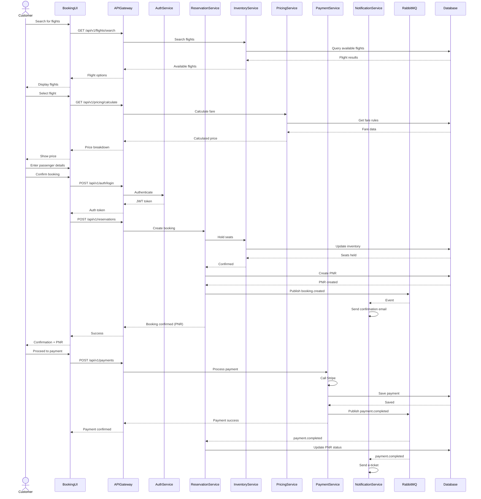
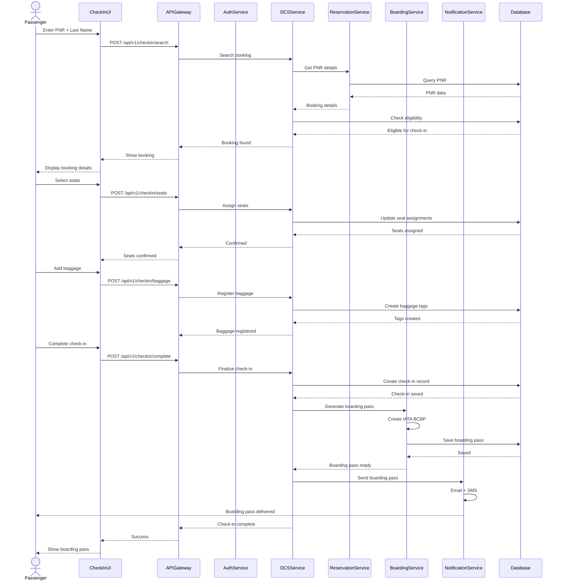
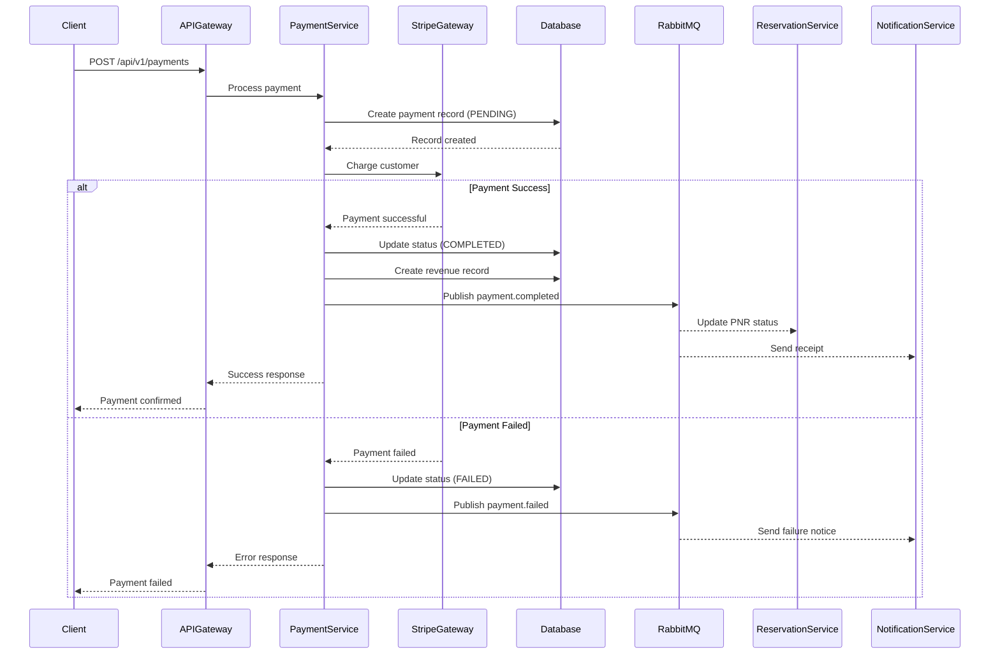
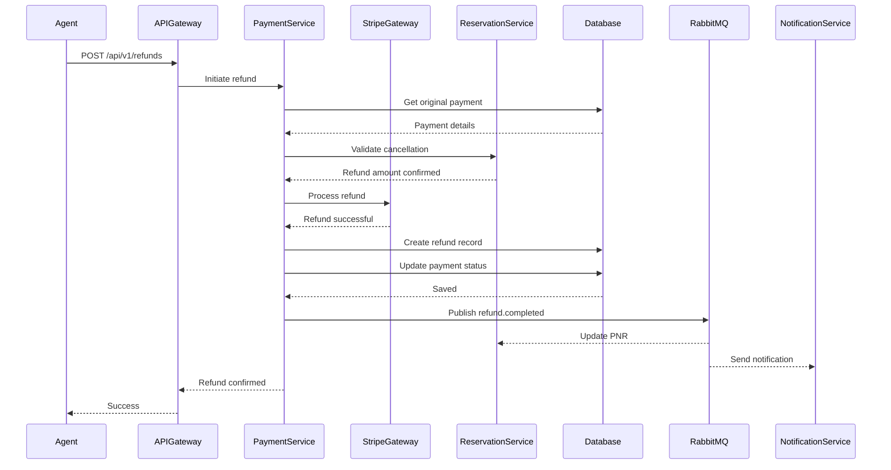
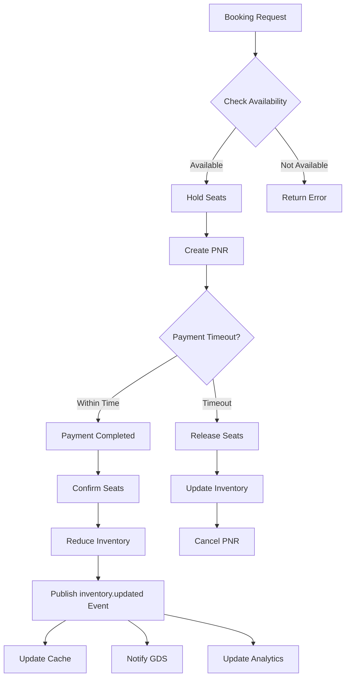
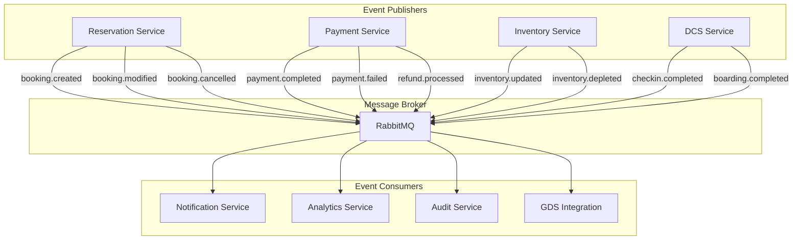
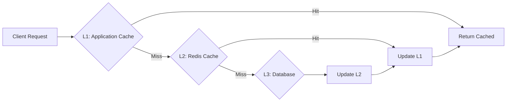

# Data Flow Architecture

## Overview

This document describes how data flows through the PSS-nano platform for key business operations. Understanding these data flows is crucial for development, debugging, and optimization.

## Booking Flow

### Complete Booking Journey



### Booking Data Structure

```typescript
// Complete booking object flow
interface BookingDataFlow {
  // Step 1: Flight Search
  searchCriteria: {
    origin: string;
    destination: string;
    departureDate: Date;
    returnDate?: Date;
    passengers: { adults: number; children: number; infants: number };
  };

  // Step 2: Flight Selection
  selectedFlight: {
    flightId: string;
    flightNumber: string;
    cabinClass: 'ECONOMY' | 'PREMIUM_ECONOMY' | 'BUSINESS' | 'FIRST';
    availableSeats: number;
  };

  // Step 3: Pricing
  pricing: {
    baseFare: number;
    taxes: number;
    fees: number;
    total: number;
    currency: string;
  };

  // Step 4: Passenger Details
  passengers: Array<{
    firstName: string;
    lastName: string;
    dateOfBirth: Date;
    gender: 'M' | 'F' | 'O';
    nationality: string;
    documentType: 'PASSPORT' | 'ID_CARD';
    documentNumber: string;
    documentExpiry: Date;
  }>;

  // Step 5: PNR Creation
  pnr: {
    pnrLocator: string; // 6-character code
    status: 'PENDING' | 'CONFIRMED' | 'PAID' | 'CANCELLED';
    createdAt: Date;
  };

  // Step 6: Payment
  payment: {
    paymentId: string;
    amount: number;
    currency: string;
    method: 'CARD' | 'PAYPAL' | 'BANK_TRANSFER';
    status: 'PENDING' | 'COMPLETED' | 'FAILED';
    transactionId: string;
  };
}
```

## Check-in Flow

### Web Check-in Process



## Payment Flow

### Payment Processing



### Refund Flow



## Inventory Management Flow

### Real-time Inventory Updates



### Inventory Synchronization

```typescript
// Inventory update propagation
interface InventoryUpdate {
  flightId: string;
  cabinClass: CabinClass;
  previousAvailable: number;
  currentAvailable: number;
  changeReason: 'BOOKING' | 'CANCELLATION' | 'ADJUSTMENT';
  timestamp: Date;
}

// Service responsibilities
const inventoryFlow = {
  // 1. Inventory Service: Source of truth
  inventoryService: async (flightId: string) => {
    const inventory = await db.flightInventory.findUnique({
      where: { flightId },
      select: { available: true }
    });

    // Update cache
    await redis.set(`inventory:${flightId}`, inventory.available, 'EX', 300);

    // Publish event
    await publishEvent('inventory.updated', {
      flightId,
      available: inventory.available
    });

    return inventory;
  },

  // 2. Cache Layer: Fast reads
  cacheLayer: async (flightId: string) => {
    const cached = await redis.get(`inventory:${flightId}`);
    if (cached) return parseInt(cached);

    // Cache miss - fetch from DB
    return await inventoryService(flightId);
  },

  // 3. GDS Sync: External system update
  gdsSync: async (event: InventoryUpdate) => {
    await gdsClient.updateAvailability({
      flightNumber: event.flightId,
      availableSeats: event.currentAvailable
    });
  },

  // 4. Analytics: Business metrics
  analyticsUpdate: async (event: InventoryUpdate) => {
    await db.bookingAnalytics.create({
      data: {
        flightId: event.flightId,
        inventoryChange: event.previousAvailable - event.currentAvailable,
        timestamp: event.timestamp
      }
    });
  }
};
```

## Event-Driven Data Flow

### Event Types and Consumers



### Event Schema

```typescript
// Base event interface
interface DomainEvent {
  eventId: string;
  eventType: string;
  aggregateId: string;
  aggregateType: string;
  timestamp: Date;
  version: number;
  correlationId?: string;
  causationId?: string;
  metadata: {
    userId?: string;
    organizationId: string;
    source: string;
  };
  payload: unknown;
}

// Booking events
interface BookingCreatedEvent extends DomainEvent {
  eventType: 'booking.created';
  aggregateType: 'PNR';
  payload: {
    pnrId: string;
    pnrLocator: string;
    passengerCount: number;
    flightId: string;
    totalAmount: number;
    status: 'PENDING';
  };
}

interface PaymentCompletedEvent extends DomainEvent {
  eventType: 'payment.completed';
  aggregateType: 'Payment';
  payload: {
    paymentId: string;
    pnrId: string;
    amount: number;
    currency: string;
    method: PaymentMethod;
    transactionId: string;
  };
}

// Event publishing
async function publishDomainEvent<T extends DomainEvent>(event: T): Promise<void> {
  await rabbitmq.publish('domain.events', event.eventType, {
    ...event,
    timestamp: new Date(),
    eventId: generateEventId()
  });

  // Also store in event store for event sourcing
  await eventStore.append(event);
}
```

## Caching Strategy

### Multi-Level Cache



### Cache Implementation

```typescript
// Three-level caching strategy
class CacheService {
  private l1Cache = new Map(); // In-memory
  private l2Cache = redis;      // Redis
  private database = prisma;    // PostgreSQL

  async get<T>(key: string, ttl: number = 300): Promise<T | null> {
    // Level 1: Application cache
    if (this.l1Cache.has(key)) {
      logger.debug(`L1 cache hit: ${key}`);
      return this.l1Cache.get(key);
    }

    // Level 2: Redis cache
    const l2Value = await this.l2Cache.get(key);
    if (l2Value) {
      logger.debug(`L2 cache hit: ${key}`);
      const parsed = JSON.parse(l2Value);
      this.l1Cache.set(key, parsed);
      return parsed;
    }

    // Level 3: Database
    logger.debug(`Cache miss: ${key}`);
    return null;
  }

  async set<T>(key: string, value: T, ttl: number = 300): Promise<void> {
    // Update all levels
    this.l1Cache.set(key, value);
    await this.l2Cache.setex(key, ttl, JSON.stringify(value));
  }

  async invalidate(key: string): Promise<void> {
    this.l1Cache.delete(key);
    await this.l2Cache.del(key);
  }
}

// Usage
const cache = new CacheService();

async function getFlightAvailability(flightId: string) {
  const cacheKey = `flight:${flightId}:availability`;

  // Try cache first
  let availability = await cache.get<number>(cacheKey);

  if (availability === null) {
    // Fetch from database
    availability = await db.flightInventory.findUnique({
      where: { flightId },
      select: { available: true }
    }).then(r => r?.available || 0);

    // Update cache
    await cache.set(cacheKey, availability, 300); // 5 min TTL
  }

  return availability;
}
```

## Data Consistency

### Eventual Consistency Pattern

```typescript
// Saga pattern for distributed transactions
class BookingCreationSaga {
  async execute(bookingData: CreateBookingDTO) {
    const sagaId = generateSagaId();
    const compensations: Array<() => Promise<void>> = [];

    try {
      // Step 1: Create PNR
      const pnr = await this.createPNR(bookingData);
      compensations.push(() => this.deletePNR(pnr.id));

      // Step 2: Hold inventory
      await this.holdInventory(bookingData.flightId, bookingData.seats);
      compensations.push(() => this.releaseInventory(bookingData.flightId, bookingData.seats));

      // Step 3: Create payment intent
      const payment = await this.createPaymentIntent(pnr.id, bookingData.amount);
      compensations.push(() => this.cancelPaymentIntent(payment.id));

      // Step 4: Publish event
      await publishEvent('booking.created', { pnrId: pnr.id, sagaId });

      return pnr;

    } catch (error) {
      // Execute compensating transactions in reverse order
      logger.error(`Saga ${sagaId} failed, executing compensations`);

      for (const compensation of compensations.reverse()) {
        try {
          await compensation();
        } catch (compError) {
          logger.error(`Compensation failed: ${compError}`);
        }
      }

      throw error;
    }
  }
}
```

## Performance Optimization

### Query Optimization

```typescript
// Bad: N+1 query problem
async function getBadBookingsWithPassengers(organizationId: string) {
  const bookings = await db.pnr.findMany({
    where: { organizationId }
  });

  // N additional queries!
  for (const booking of bookings) {
    booking.passengers = await db.passenger.findMany({
      where: { pnrId: booking.id }
    });
  }

  return bookings;
}

// Good: Single query with joins
async function getGoodBookingsWithPassengers(organizationId: string) {
  return await db.pnr.findMany({
    where: { organizationId },
    include: {
      passengers: true,
      segments: {
        include: {
          flight: true
        }
      }
    }
  });
}

// Even better: Pagination + selective fields
async function getOptimalBookingsWithPassengers(
  organizationId: string,
  page: number = 1,
  limit: number = 20
) {
  return await db.pnr.findMany({
    where: { organizationId },
    select: {
      id: true,
      pnrLocator: true,
      status: true,
      passengers: {
        select: {
          id: true,
          firstName: true,
          lastName: true
        }
      }
    },
    skip: (page - 1) * limit,
    take: limit,
    orderBy: { createdAt: 'desc' }
  });
}
```

## Conclusion

Understanding data flow through PSS-nano is essential for:
- **Development**: Building new features correctly
- **Debugging**: Tracing issues through the system
- **Optimization**: Identifying bottlenecks
- **Monitoring**: Knowing what to measure

Key takeaways:
1. Data flows through multiple services via REST APIs and events
2. Caching reduces database load and improves performance
3. Events enable loose coupling and eventual consistency
4. Proper error handling and compensations ensure data integrity
5. Monitoring data flow helps identify issues early
