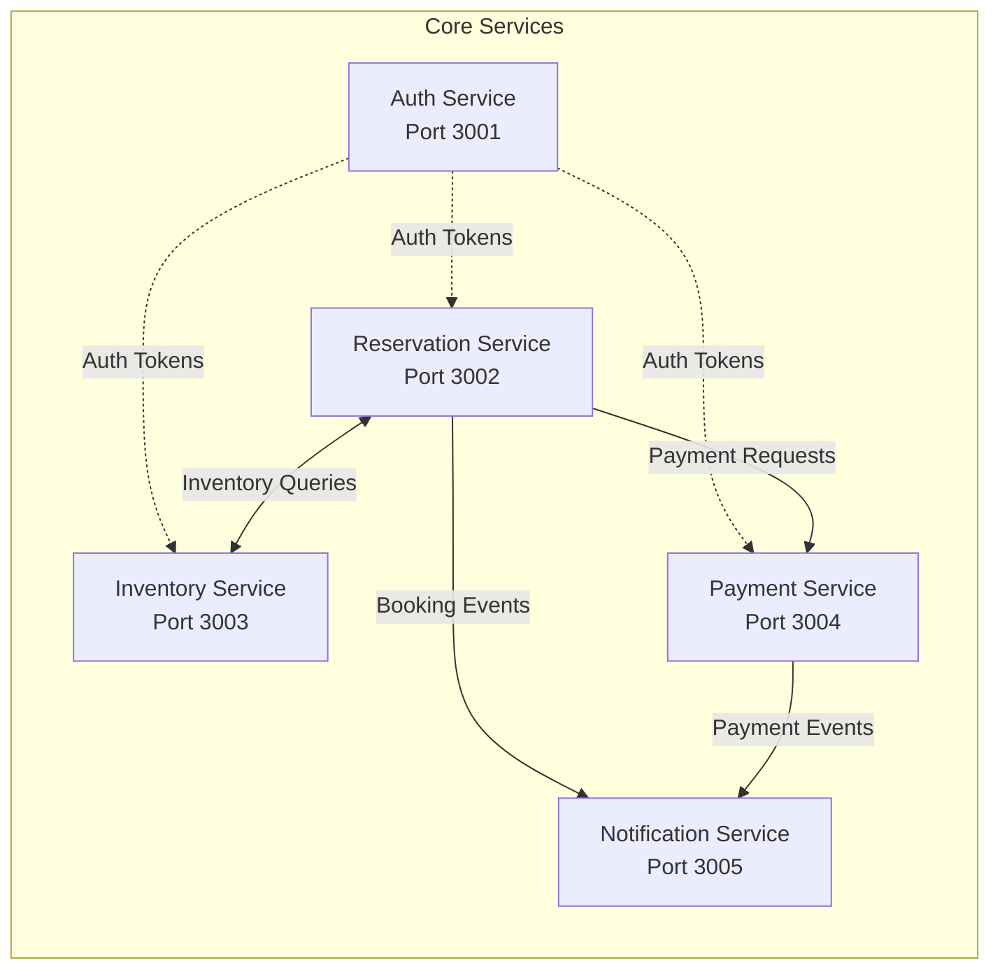
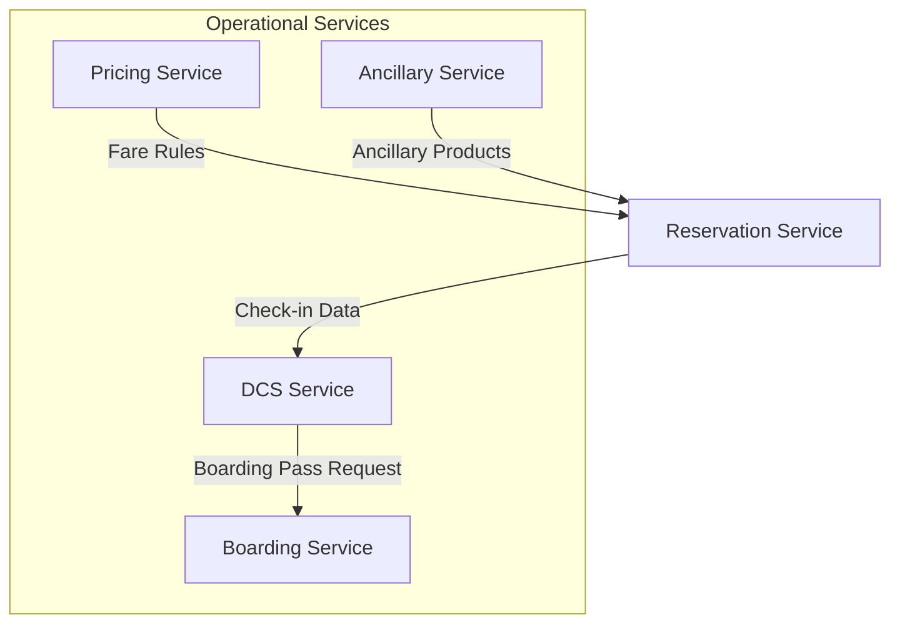
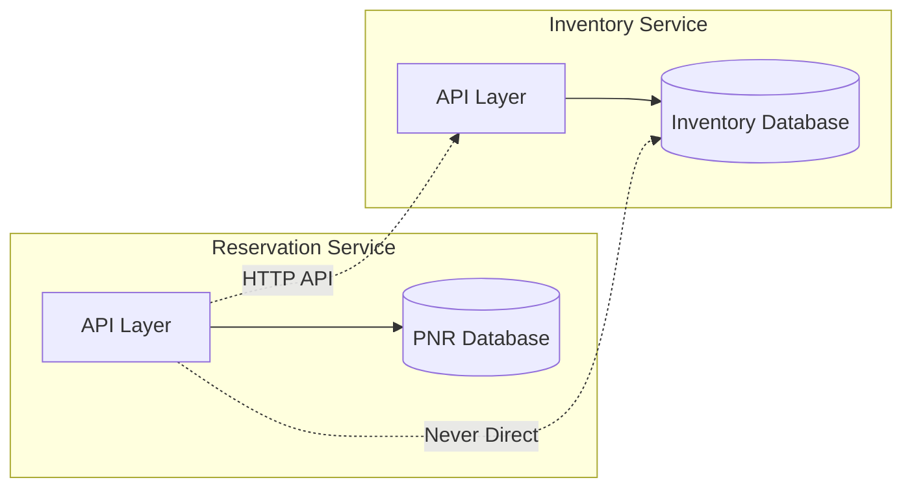
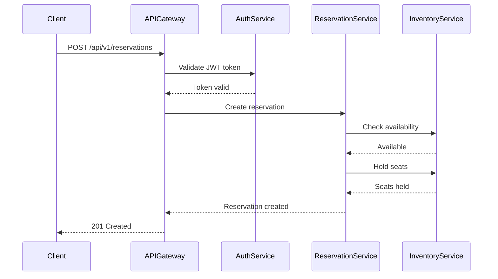
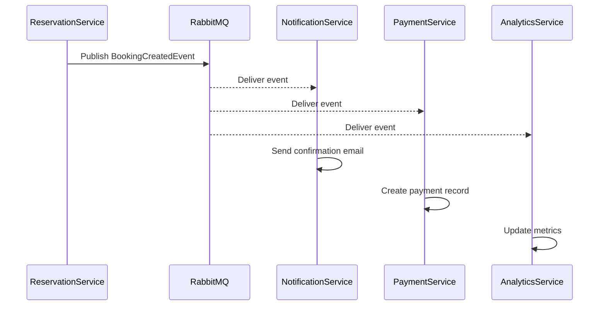

# Microservices Architecture

## Overview

PSS-nano implements a microservices architecture where the application is composed of 18 independent services, each responsible for a specific business capability. This document details the microservices design, communication patterns, and best practices.

## Microservices Inventory

### Core Business Services (5 services)



| Service | Port | Responsibility | Database Tables |
|---------|------|---------------|-----------------|
| **Auth Service** | 3001 | Authentication, authorization, user management, MFA | User, Role, Permission, ApiKey, AuditLog |
| **Reservation Service** | 3002 | PNR management, booking workflow, passenger data | PNR, PNRSegment, Passenger, Ticket |
| **Inventory Service** | 3003 | Seat inventory, availability, seat maps | Flight, FlightInventory, SeatMap |
| **Payment Service** | 3004 | Payment processing, refunds, revenue accounting | Payment, Refund, RevenueAccounting |
| **Notification Service** | 3005 | Email, SMS, push notifications | (Event-driven, no persistent storage) |

### Operational Services (4 services)



| Service | Responsibility | Key Features |
|---------|---------------|--------------|
| **Pricing Service** | Dynamic pricing, fare calculation, fare rules | Complex fare logic, seasonal pricing, promotional fares |
| **Ancillary Service** | Seat selection, meals, baggage, other add-ons | Product catalog, availability, pricing |
| **Boarding Service** | Boarding pass generation, gate control, validation | IATA BCBP barcode, mobile boarding pass |
| **DCS Service** | Check-in, baggage handling, departure control | Multi-channel check-in, baggage tracking |

### Integration Services (3 services)

| Service | Responsibility | Integrations |
|---------|---------------|--------------|
| **GDS Integration Service** | Connect to Global Distribution Systems | Amadeus, Sabre, Galileo |
| **Airport Integration Service** | Airport systems connectivity | SITA, ARINC, airport-specific systems |
| **Regulatory Compliance Service** | Government reporting, compliance | API, APIS, customs declarations |

### Support Services (6 services)

| Service | Responsibility |
|---------|---------------|
| **Analytics Service** | Business intelligence, reporting, data warehousing |
| **Marketing Service** | Campaign management, customer segmentation |
| **Load Control Service** | Weight & balance calculations, load planning |
| **CMS Service** | Content management, configuration |
| **API Gateway** | Request routing, authentication, rate limiting |

## Service Design Principles

### 1. Single Responsibility
Each service has one clear business responsibility:
```typescript
// Good: Reservation Service handles only booking logic
class ReservationService {
  createBooking()
  modifyBooking()
  cancelBooking()
}

// Bad: Mixing concerns
class ReservationService {
  createBooking()
  processPayment()  // Should be in Payment Service
  sendEmail()       // Should be in Notification Service
}
```

### 2. Database per Service
Each service owns its data:


### 3. API-First Design
All services expose well-defined REST APIs:
```typescript
// OpenAPI specification example
/**
 * @swagger
 * /api/v1/reservations:
 *   post:
 *     summary: Create a new reservation
 *     requestBody:
 *       required: true
 *       content:
 *         application/json:
 *           schema:
 *             $ref: '#/components/schemas/CreateReservationRequest'
 *     responses:
 *       201:
 *         description: Reservation created
 */
```

### 4. Stateless Services
Services don't maintain session state:
```typescript
// Good: Stateless
app.get('/api/reservations/:id', authenticate, async (req, res) => {
  const user = req.user; // From JWT token
  const reservation = await getReservation(req.params.id);
  res.json(reservation);
});

// Bad: Stateful (using in-memory session)
const sessions = {};
app.get('/api/reservations/:id', (req, res) => {
  const user = sessions[req.sessionId]; // Don't do this
});
```

### 5. Independent Deployment
Services can be deployed independently:
```yaml
# Kubernetes deployment for Reservation Service
apiVersion: apps/v1
kind: Deployment
metadata:
  name: reservation-service
spec:
  replicas: 3
  selector:
    matchLabels:
      app: reservation-service
  template:
    metadata:
      labels:
        app: reservation-service
        version: v1.2.3
    spec:
      containers:
      - name: reservation-service
        image: pss-nano/reservation-service:v1.2.3
        ports:
        - containerPort: 3002
```

## Service Communication Patterns

### 1. Synchronous Communication (REST)

Used for request-response operations:



**Implementation Example:**
```typescript
// Reservation Service calling Inventory Service
async function checkAvailability(flightId: string, seatClass: string) {
  try {
    const response = await axios.get(
      `${INVENTORY_SERVICE_URL}/api/v1/flights/${flightId}/availability`,
      {
        params: { seatClass },
        timeout: 5000,
        headers: { 'Authorization': `Bearer ${serviceToken}` }
      }
    );
    return response.data;
  } catch (error) {
    // Circuit breaker will handle failures
    throw new InventoryServiceError('Failed to check availability');
  }
}
```

### 2. Asynchronous Communication (Events)

Used for fire-and-forget operations:



**Implementation Example:**
```typescript
// Publishing event
import { publishEvent } from '@pss-nano/observability';

async function createBooking(bookingData: CreateBookingDTO) {
  const booking = await db.pnr.create({ data: bookingData });

  // Publish event asynchronously
  await publishEvent('booking.created', {
    pnrId: booking.id,
    pnrLocator: booking.pnrLocator,
    passengerCount: booking.passengers.length,
    totalAmount: booking.totalAmount,
    timestamp: new Date()
  });

  return booking;
}

// Consuming event in Notification Service
import { consumeEvent } from '@pss-nano/observability';

consumeEvent('booking.created', async (event) => {
  const { pnrId, pnrLocator } = event;

  // Send confirmation email
  await sendBookingConfirmation(pnrId);

  // Send SMS
  await sendBookingSMS(pnrLocator);
});
```

### 3. Service Discovery

Services discover each other using Consul:

```typescript
// Service registration
import Consul from 'consul';

const consul = new Consul();

async function registerService() {
  await consul.agent.service.register({
    id: 'reservation-service-1',
    name: 'reservation-service',
    address: process.env.SERVICE_HOST,
    port: 3002,
    check: {
      http: `http://${process.env.SERVICE_HOST}:3002/health`,
      interval: '10s',
      timeout: '5s'
    }
  });
}

// Service discovery
async function getInventoryServiceUrl() {
  const services = await consul.health.service('inventory-service');
  const healthyServices = services.filter(s => s.checks.every(c => c.status === 'passing'));
  // Round-robin or other load balancing
  return healthyServices[Math.floor(Math.random() * healthyServices.length)].Service.Address;
}
```

## Resilience Patterns

### 1. Circuit Breaker

Prevents cascade failures:

```typescript
import CircuitBreaker from 'opossum';

const options = {
  timeout: 3000,
  errorThresholdPercentage: 50,
  resetTimeout: 30000
};

const breaker = new CircuitBreaker(callInventoryService, options);

breaker.fallback(() => ({
  available: false,
  message: 'Inventory service temporarily unavailable'
}));

breaker.on('open', () => {
  logger.warn('Circuit breaker opened for inventory service');
});

async function checkInventory(flightId: string) {
  return await breaker.fire(flightId);
}
```

### 2. Retry with Exponential Backoff

```typescript
import { retry } from '@pss-nano/shared-utils';

async function createPayment(paymentData: PaymentDTO) {
  return await retry(
    () => paymentGateway.charge(paymentData),
    {
      retries: 3,
      minTimeout: 1000,
      maxTimeout: 5000,
      factor: 2,
      onRetry: (error, attempt) => {
        logger.warn(`Payment attempt ${attempt} failed: ${error.message}`);
      }
    }
  );
}
```

### 3. Timeout Enforcement

```typescript
import { withTimeout } from '@pss-nano/shared-utils';

async function callExternalService() {
  try {
    return await withTimeout(
      externalServiceCall(),
      5000, // 5 second timeout
      'External service timeout'
    );
  } catch (error) {
    if (error.name === 'TimeoutError') {
      // Handle timeout
      return fallbackResponse();
    }
    throw error;
  }
}
```

### 4. Bulkhead Pattern

Isolate resources to prevent total failure:

```typescript
// Separate thread pools for different operations
import Bottleneck from 'bottleneck';

// Critical operations - higher priority
const criticalLimiter = new Bottleneck({
  maxConcurrent: 10,
  minTime: 100
});

// Non-critical operations - lower priority
const nonCriticalLimiter = new Bottleneck({
  maxConcurrent: 5,
  minTime: 200
});

async function createBooking(data: BookingDTO) {
  return await criticalLimiter.schedule(() => _createBooking(data));
}

async function generateReport(params: ReportParams) {
  return await nonCriticalLimiter.schedule(() => _generateReport(params));
}
```

## Service Versioning

### API Versioning Strategy

**URL Versioning (Current):**
```typescript
// v1 API
app.use('/api/v1/reservations', reservationRouterV1);

// v2 API (when breaking changes needed)
app.use('/api/v2/reservations', reservationRouterV2);
```

**Header Versioning (Future):**
```typescript
app.use('/api/reservations', (req, res, next) => {
  const apiVersion = req.headers['api-version'] || 'v1';
  if (apiVersion === 'v1') {
    return reservationRouterV1(req, res, next);
  } else if (apiVersion === 'v2') {
    return reservationRouterV2(req, res, next);
  }
  return res.status(400).json({ error: 'Unsupported API version' });
});
```

### Backward Compatibility

```typescript
// Good: Backward compatible change
interface BookingResponseV1 {
  id: string;
  pnrLocator: string;
  status: string;
}

interface BookingResponseV2 extends BookingResponseV1 {
  createdAt: string; // New field (additive)
  passengers: Passenger[]; // New field (additive)
}

// Bad: Breaking change (requires new version)
interface BookingResponseV2 {
  bookingId: string; // Renamed from 'id'
  status: BookingStatus; // Changed type from string to enum
}
```

## Service Metrics & Monitoring

### Key Metrics per Service

```typescript
import { Counter, Histogram, Gauge } from 'prom-client';

// Request counter
const httpRequestsTotal = new Counter({
  name: 'http_requests_total',
  help: 'Total HTTP requests',
  labelNames: ['method', 'route', 'status_code']
});

// Response time histogram
const httpRequestDuration = new Histogram({
  name: 'http_request_duration_seconds',
  help: 'HTTP request duration in seconds',
  labelNames: ['method', 'route'],
  buckets: [0.1, 0.3, 0.5, 0.7, 1, 3, 5, 7, 10]
});

// Active connections gauge
const activeConnections = new Gauge({
  name: 'active_connections',
  help: 'Number of active database connections'
});

// Middleware to track metrics
app.use((req, res, next) => {
  const start = Date.now();

  res.on('finish', () => {
    const duration = (Date.now() - start) / 1000;

    httpRequestsTotal.inc({
      method: req.method,
      route: req.route?.path || 'unknown',
      status_code: res.statusCode
    });

    httpRequestDuration.observe({
      method: req.method,
      route: req.route?.path || 'unknown'
    }, duration);
  });

  next();
});
```

## Service Health Checks

### Liveness Probe
Checks if service is running:

```typescript
app.get('/health', (req, res) => {
  res.status(200).json({ status: 'UP' });
});
```

### Readiness Probe
Checks if service is ready to receive traffic:

```typescript
app.get('/health/ready', async (req, res) => {
  try {
    // Check database connection
    await db.$queryRaw`SELECT 1`;

    // Check Redis connection
    await redis.ping();

    // Check RabbitMQ connection
    if (!rabbitmqChannel || rabbitmqChannel.connection.isConnected() === false) {
      throw new Error('RabbitMQ not connected');
    }

    res.status(200).json({
      status: 'READY',
      checks: {
        database: 'UP',
        redis: 'UP',
        rabbitmq: 'UP'
      }
    });
  } catch (error) {
    res.status(503).json({
      status: 'NOT_READY',
      error: error.message
    });
  }
});
```

## Best Practices

### 1. Service Size
- Keep services focused on a single business capability
- Aim for 1,000-5,000 lines of code per service
- If > 10,000 lines, consider splitting

### 2. Data Management
- Each service owns its database schema
- No direct database access between services
- Use API calls or events for data sharing
- Implement eventual consistency where appropriate

### 3. Error Handling
- Use circuit breakers for external calls
- Implement graceful degradation
- Return meaningful error messages
- Log errors with correlation IDs

### 4. Testing
- 80%+ code coverage for unit tests
- Integration tests for all API endpoints
- Contract tests for service boundaries
- Load tests for performance validation

### 5. Documentation
- OpenAPI/Swagger for all APIs
- README with setup instructions
- Architecture diagrams
- Runbooks for operations

## Common Pitfalls

### 1. Service Coupling
```typescript
// Bad: Tight coupling
class ReservationService {
  async createBooking() {
    // Direct database access to inventory DB
    const inventory = await inventoryDb.query('SELECT ...');
  }
}

// Good: Loose coupling via API
class ReservationService {
  async createBooking() {
    const inventory = await inventoryServiceClient.getAvailability();
  }
}
```

### 2. Distributed Monolith
Avoid creating a distributed monolith where all services must be deployed together.

### 3. Chatty Services
Minimize the number of service-to-service calls:
```typescript
// Bad: Multiple calls
const passenger = await getPassenger(id);
const booking = await getBooking(passenger.bookingId);
const flight = await getFlight(booking.flightId);

// Good: Single aggregated call
const bookingDetails = await getBookingWithDetails(passengerId);
```

### 4. Lack of Observability
Always implement:
- Structured logging with correlation IDs
- Distributed tracing
- Metrics collection
- Health checks

## Conclusion

The microservices architecture provides PSS-nano with:
- **Scalability**: Independent scaling of services
- **Resilience**: Failure isolation
- **Flexibility**: Technology freedom per service
- **Maintainability**: Clear service boundaries
- **Team Autonomy**: Independent development and deployment

Follow the patterns and best practices outlined in this document to maintain the integrity of the microservices architecture.
