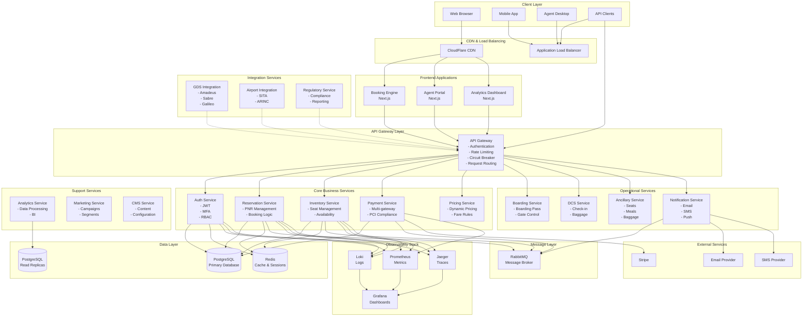

# Architecture Overview

## Introduction

PSS-nano is designed as a modern, cloud-native passenger service system built on microservices architecture. This document provides a high-level overview of the system architecture, design principles, and key architectural decisions.

## Architectural Principles

### 1. Microservices Architecture
- **Service Independence**: Each service is independently deployable and scalable
- **Domain-Driven Design**: Services organized around business domains
- **Data Ownership**: Each service owns its data and database schema
- **API-First Design**: All services expose well-defined REST APIs

### 2. Event-Driven Architecture
- **Asynchronous Communication**: Services communicate via RabbitMQ for non-blocking operations
- **Event Sourcing**: Critical events are logged and can be replayed
- **CQRS Pattern**: Separation of read and write operations where beneficial

### 3. Cloud-Native Design
- **Containerization**: All services containerized with Docker
- **Orchestration**: Kubernetes for container orchestration
- **Scalability**: Horizontal scaling support for all services
- **Resilience**: Circuit breakers, retries, and graceful degradation

### 4. Security First
- **Zero Trust**: No implicit trust between services
- **Defense in Depth**: Multiple layers of security controls
- **Least Privilege**: Services have minimal required permissions
- **Encryption**: Data encrypted in transit and at rest

## High-Level Architecture

## Layer Description

### 1. Client Layer
Different types of clients accessing the platform:
- **Web Browsers**: Customer-facing booking engine
- **Mobile Apps**: iOS and Android applications
- **Agent Desktop**: Internal agent portal
- **API Clients**: Third-party integrations

### 2. CDN & Load Balancing
- **CloudFlare CDN**: Static asset delivery and DDoS protection
- **Application Load Balancer**: Traffic distribution across instances
- **SSL/TLS Termination**: Secure connection handling

### 3. API Gateway
Central entry point providing:
- **Authentication & Authorization**: JWT validation, API key management
- **Rate Limiting**: Per-client rate limits
- **Circuit Breaker**: Fault tolerance and resilience
- **Request Routing**: Intelligent routing to backend services
- **Request/Response Transformation**: Protocol translation

### 4. Microservices Layer

#### Core Business Services
Handle primary airline operations:
- **Auth Service**: User authentication, authorization, MFA
- **Reservation Service**: PNR management, booking workflow
- **Inventory Service**: Real-time seat inventory, availability
- **Payment Service**: Payment processing, refunds, accounting
- **Pricing Service**: Fare calculation, dynamic pricing

#### Operational Services
Handle day-of-travel operations:
- **Boarding Service**: Boarding pass generation, gate control
- **DCS Service**: Check-in, baggage handling
- **Ancillary Service**: Additional products and services
- **Notification Service**: Multi-channel customer communications

#### Integration Services
Connect to external systems:
- **GDS Integration**: Global distribution systems
- **Airport Integration**: Airport operational systems
- **Regulatory Service**: Government compliance and reporting

#### Support Services
Additional business capabilities:
- **Analytics Service**: Business intelligence, reporting
- **Marketing Service**: Campaign management, segmentation
- **CMS Service**: Content and configuration management

### 5. Data Layer

#### PostgreSQL Database
- **Primary**: Write operations, transactional consistency
- **Read Replicas**: Read scaling, analytics queries
- **Multi-tenant Schema**: Logical isolation per airline
- **Connection Pooling**: PgBouncer for efficient connections

#### Redis Cache
- **Session Storage**: User sessions, JWT tokens
- **Application Cache**: Frequently accessed data
- **Rate Limiting**: Token bucket counters
- **Pub/Sub**: Real-time notifications

### 6. Message Layer

#### RabbitMQ
- **Event Bus**: Service-to-service async communication
- **Task Queues**: Background job processing
- **Routing**: Topic-based message routing
- **Guaranteed Delivery**: Persistent messaging with acknowledgments

### 7. Observability Stack

Complete observability solution:
- **Prometheus**: Metrics collection and alerting
- **Loki**: Log aggregation and querying
- **Jaeger**: Distributed tracing
- **Grafana**: Unified visualization (6 dashboards, 21 alerts)

## Key Architectural Patterns

### 1. API Gateway Pattern
Single entry point for all client requests:
- Simplifies client logic
- Centralizes cross-cutting concerns
- Enables easier API versioning
- Provides security perimeter

### 2. Service Mesh (Future)
Service-to-service communication framework:
- Mutual TLS between services
- Advanced traffic management
- Observability injection
- Resilience patterns

### 3. Database per Service
Each service owns its database:
- Independent scaling
- Technology choice freedom
- Failure isolation
- Clear service boundaries

### 4. Event-Driven Communication
Asynchronous messaging via RabbitMQ:
- Loose coupling
- Scalability
- Fault tolerance
- Event sourcing capability

### 5. CQRS (Command Query Responsibility Segregation)
Separation of read and write models:
- Optimized read performance
- Complex query support
- Event sourcing integration
- Analytics capabilities

### 6. Circuit Breaker Pattern
Fault tolerance using Opossum:
- Prevents cascade failures
- Fast failure detection
- Automatic recovery
- Fallback strategies

### 7. Strangler Fig Pattern
Gradual migration strategy:
- Legacy system integration
- Incremental modernization
- Risk mitigation
- Continuous delivery

## Scalability Strategy

### Horizontal Scaling
All services designed for horizontal scaling:
- **Stateless Services**: All application state externalized
- **Load Balancing**: Round-robin and least-connection
- **Auto-scaling**: Kubernetes HPA based on CPU/memory/custom metrics
- **Database Scaling**: Read replicas, connection pooling

### Vertical Scaling
Resource optimization per service:
- Right-sized containers
- Resource limits and requests
- Performance profiling
- Memory optimization

### Caching Strategy
Multi-level caching:
- **L1 - Application**: In-memory caching
- **L2 - Redis**: Distributed cache
- **L3 - CDN**: Static asset caching
- **L4 - Database**: Query result caching

## Resilience & Reliability

### High Availability
- **Multi-AZ Deployment**: Services across availability zones
- **Database Replication**: Automatic failover
- **Zero-Downtime Deployments**: Rolling updates
- **Health Checks**: Kubernetes liveness/readiness probes

### Fault Tolerance
- **Circuit Breakers**: Prevent cascade failures
- **Retries with Backoff**: Automatic retry logic
- **Timeouts**: Request timeout enforcement
- **Graceful Degradation**: Fallback to reduced functionality

### Data Durability
- **Database Backups**: Automated daily backups, 30-day retention
- **Point-in-Time Recovery**: Transaction log backup
- **Disaster Recovery**: Cross-region replication
- **Message Durability**: Persistent queues with acknowledgments

## Performance Targets

### Service Level Objectives (SLOs)
- **Availability**: 99.9% uptime (43 minutes downtime/month)
- **API Latency**: P95 < 200ms, P99 < 500ms
- **Database Queries**: P95 < 50ms
- **Throughput**: 1,000+ concurrent users, 10,000+ requests/minute

### Performance Optimization
- **Database Indexing**: Strategic index design
- **Query Optimization**: N+1 query elimination
- **Connection Pooling**: Efficient resource usage
- **Code Profiling**: Regular performance analysis

## Security Architecture

### Authentication & Authorization
- **JWT Tokens**: Stateless authentication
- **MFA Support**: TOTP-based two-factor
- **RBAC**: Role-based access control (5 levels)
- **API Keys**: Scoped API access

### Data Protection
- **Encryption in Transit**: TLS 1.3
- **Encryption at Rest**: Database encryption
- **PII Masking**: Automatic log masking
- **Secret Management**: HashiCorp Vault / AWS Secrets Manager

### Network Security
- **Service Mesh**: mTLS between services (future)
- **Network Policies**: Kubernetes network isolation
- **WAF**: Web Application Firewall
- **DDoS Protection**: CloudFlare protection

## Technology Rationale

### Why Node.js + TypeScript?
- **Performance**: Non-blocking I/O for high concurrency
- **Developer Productivity**: Same language frontend/backend
- **Type Safety**: TypeScript reduces runtime errors
- **Ecosystem**: Rich npm package ecosystem
- **Hiring**: Large talent pool

### Why PostgreSQL?
- **ACID Compliance**: Strong transactional guarantees
- **Scalability**: Handles billions of rows
- **JSON Support**: Flexible schema evolution
- **Mature Ecosystem**: Proven in production
- **Open Source**: No vendor lock-in

### Why RabbitMQ?
- **Reliability**: Message persistence and acknowledgments
- **Routing Flexibility**: Topic exchanges, routing keys
- **Management UI**: Built-in monitoring
- **Performance**: Handles 100K+ messages/second
- **Community**: Strong community support

### Why Kubernetes?
- **Orchestration**: Automated deployment, scaling
- **Self-Healing**: Automatic restarts, rescheduling
- **Service Discovery**: Built-in DNS
- **Configuration**: ConfigMaps and Secrets
- **Ecosystem**: Rich tooling ecosystem

## Future Architectural Enhancements

### Short-term (3-6 months)
- **Service Mesh**: Implement Istio for advanced traffic management
- **GraphQL Gateway**: Aggregate APIs for frontend
- **Kafka Integration**: High-throughput event streaming
- **ElasticSearch**: Full-text search capabilities

### Medium-term (6-12 months)
- **Multi-Region Deployment**: Geographic distribution
- **Event Sourcing**: Complete event store implementation
- **ML/AI Integration**: Predictive analytics, recommendation engine
- **Blockchain**: Loyalty points, distributed ledger

### Long-term (12+ months)
- **Serverless Functions**: AWS Lambda / Cloud Functions
- **Edge Computing**: Edge deployment for low latency
- **Quantum-Ready Encryption**: Post-quantum cryptography
- **AI-Driven Operations**: AIOps for automated incident response

## Conclusion

The PSS-nano architecture is designed for:
- **Scalability**: Handle millions of bookings
- **Reliability**: 99.9% uptime
- **Performance**: Sub-200ms response times
- **Maintainability**: Clean service boundaries
- **Security**: Enterprise-grade protection
- **Extensibility**: Easy to add new services

This architecture supports current airline operations while providing a foundation for future innovation and growth.
