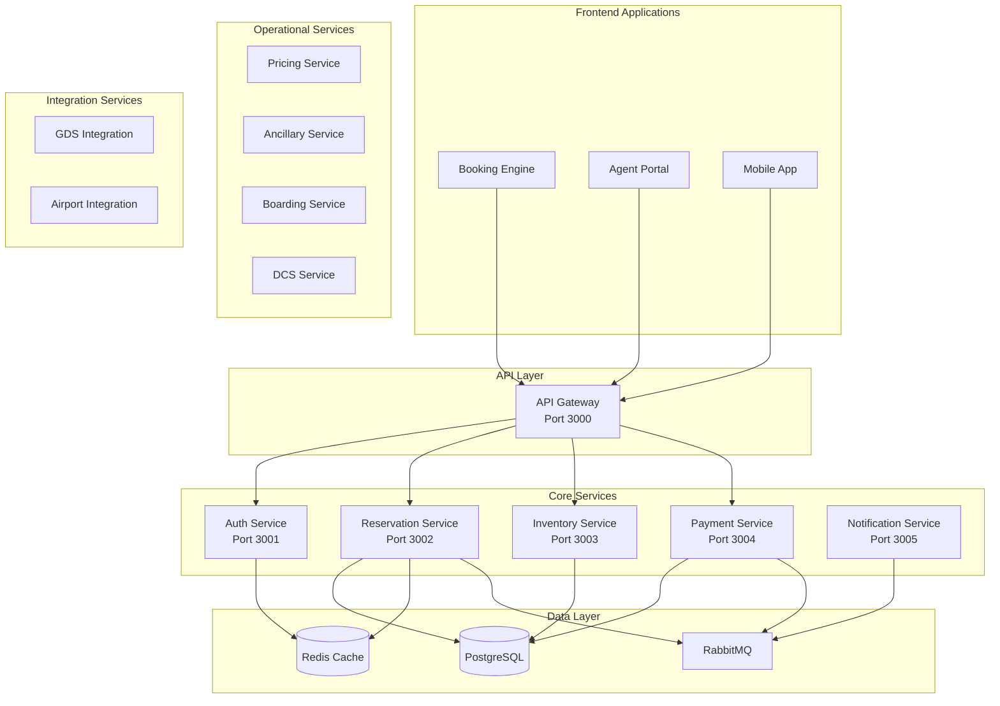

# Getting Started with PSS-nano

Welcome to the PSS-nano (Passenger Service System) developer documentation! This guide will help you get up and running with the platform.

## What is PSS-nano?

PSS-nano is a comprehensive, enterprise-grade airline passenger service system built with modern microservices architecture. It provides a complete solution for airline operations from booking to boarding, including:

- **18 Microservices** handling different aspects of airline operations
- **5 Frontend Applications** for customers, agents, and analytics
- **Multi-tenant Architecture** supporting multiple airlines
- **Production-ready Observability** with Prometheus, Grafana, Loki, and Jaeger
- **Comprehensive Testing** with 80%+ code coverage
- **Cloud-native Deployment** ready for Kubernetes

## Key Features

### Core Capabilities
- ✈️ Flight reservations and PNR management
- 💺 Real-time inventory and seat management
- 💳 Multi-gateway payment processing (Stripe, PayPal, etc.)
- 📧 Multi-channel notifications (Email, SMS)
- 🎫 Boarding pass generation and validation
- 🧳 End-to-end baggage tracking
- 💰 Dynamic pricing and fare management
- 🍽️ Ancillary services (baggage, meals, seat selection)
- 📊 Advanced analytics and reporting
- 🔐 Enterprise-grade security (JWT, MFA, RBAC)

### Integration Support
- Global Distribution Systems (GDS): Amadeus, Sabre, Galileo
- Airport systems: SITA, ARINC
- Payment gateways: Stripe, PayPal, others
- Government systems for regulatory compliance

## Technology Stack

### Backend
- **Runtime**: Node.js 20+
- **Language**: TypeScript 5.3+
- **Framework**: Express.js 4.18+
- **ORM**: Prisma 5.8+ with PostgreSQL 16
- **Cache**: Redis 7
- **Message Queue**: RabbitMQ 3.12
- **Authentication**: JWT with MFA support

### Frontend
- **Framework**: Next.js 14+ (App Router)
- **UI Library**: React 18.2+
- **Styling**: TailwindCSS 3.4+
- **State**: Zustand, React Query

### Infrastructure
- **Database**: PostgreSQL 16 (via Neon)
- **Containerization**: Docker & Docker Compose
- **Orchestration**: Kubernetes
- **IaC**: Terraform (AWS/GCP)

### Observability
- **Metrics**: Prometheus
- **Logging**: Loki + Promtail
- **Tracing**: Jaeger with OpenTelemetry
- **Visualization**: Grafana (6 dashboards)
- **Alerting**: AlertManager (21 rules)

## Quick Start

### Prerequisites
- Node.js 20+ and npm 10+
- Docker & Docker Compose
- Git

### Installation

1. **Clone the repository**
   ```bash
   git clone https://github.com/jbandu/PSS-nano.git
   cd PSS-nano
   ```

2. **Install dependencies**
   ```bash
   npm install
   ```

3. **Set up environment variables**
   ```bash
   cp .env.example .env
   # Edit .env with your configuration
   ```

4. **Start infrastructure services**
   ```bash
   docker-compose up -d
   ```

5. **Generate Prisma client and set up database**
   ```bash
   cd packages/database-schemas
   npx prisma generate
   npx prisma db push
   cd ../..
   ```

6. **Start all services**
   ```bash
   npm run dev
   ```

7. **Access the applications**
   - API Gateway: http://localhost:3000
   - Auth Service: http://localhost:3001
   - Booking Engine: http://localhost:4001
   - Agent Portal: http://localhost:4000
   - Grafana Dashboard: http://localhost:3010 (admin/admin)
   - Prometheus: http://localhost:9090
   - Jaeger Tracing: http://localhost:16686

## Architecture Overview

PSS-nano uses a **microservices architecture** with the following components:



## Project Structure

```
PSS-nano/
├── services/               # 18 backend microservices
│   ├── api-gateway/       # Central API gateway
│   ├── auth-service/      # Authentication & authorization
│   ├── reservation-service/ # PNR and booking logic
│   ├── inventory-service/ # Seat inventory
│   ├── payment-service/   # Payment processing
│   └── ...
├── apps/                  # 5 frontend applications
│   ├── booking-engine/    # Customer booking (Next.js)
│   ├── agent-portal/      # Agent dashboard (Next.js)
│   └── mobile-app/        # React Native app
├── packages/              # Shared code
│   ├── database-schemas/  # Prisma schemas
│   ├── shared-types/      # TypeScript types
│   ├── shared-utils/      # Utilities
│   └── observability/     # Monitoring package
├── infrastructure/        # Infrastructure as Code
│   ├── kubernetes/        # K8s manifests
│   ├── terraform/         # Cloud resources
│   └── observability/     # Monitoring stack
├── e2e-tests/            # End-to-end tests
├── load-tests/           # k6 performance tests
└── test-setup/           # Global test configuration
```

## Next Steps

Now that you have the platform running, here are some recommended next steps:

1. **Understand the Architecture**
   - Read the [Architecture Overview](architecture/overview.md)
   - Learn about [Microservices Design](architecture/microservices.md)
   - Understand [Data Flow](architecture/data-flow.md)

2. **Explore the Services**
   - Review the [Service Catalog](services/catalog.md)
   - Learn about key services like [Reservation](services/reservation-service.md) and [Inventory](services/inventory-service.md)

3. **Set Up Your Development Environment**
   - Follow the detailed [Development Setup Guide](guides/development-setup.md)
   - Configure your IDE for [Debugging](guides/debugging.md)
   - Learn our [Code Standards](guides/code-standards.md)

4. **Make Your First Contribution**
   - Read the [Contributing Guide](contributing.md)
   - Review the [Git Workflow](guides/git-workflow.md)
   - Check out the [Testing Guide](guides/testing.md)

5. **Understand Operations**
   - Learn about [Monitoring](guides/monitoring.md)
   - Explore [Deployment Processes](guides/deployment.md)
   - Review [Security Guidelines](security/overview.md)

## Getting Help

If you encounter any issues:

- Check the [FAQ](guides/faq.md)
- Review the [Troubleshooting Guide](guides/troubleshooting.md)
- Search existing GitHub issues
- Ask in the team Slack channel

## Documentation Structure

This documentation is organized into several sections:

- **Architecture**: System design, microservices, data flow, and technology decisions
- **Services**: Detailed documentation for each microservice
- **API Reference**: Complete API documentation with examples
- **Data Model**: Database schemas, relationships, and migrations
- **Guides**: How-to guides for development, testing, deployment, and operations
- **Security**: Security best practices and guidelines

Use the navigation menu to explore these sections.

Welcome aboard! 🚀
